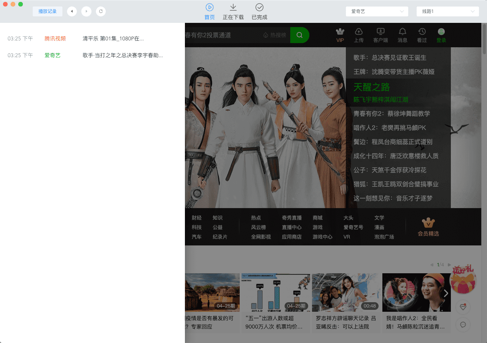

<p align="center"></p>

一个快速，简单，干净可以播放并且下载国内主流视频的播放器。A fast, simple, clean player that can play and download mainstream video in China.

## 下载

- [下载体验](https://gitee.com/meetqy/hapv/releases)

## 界面

<p style='display: inline-flex;justify-content: space-between;'></p>
<p style='display: inline-flex;justify-content: space-between;'></p>

## 技术栈&插件

- Electron
- Vue
- vue-cli-plugin-electron-builder
- Element

下载功能需安装 [annie](https://github.com/iawia002/annie)

## 如何运行

```
git clone git@github.com:meetqy/hapv.git
```

```
cd hapv
```

```
npm install
```

```
npm start
```

## 原理

1. 利用`electron`框架，返回 web 页面
2. 页面中嵌入 webview，url 为各平台官网
3. 利用`electron`提供的 api，监听页面跳转，劫持链接，返回解析之后的视频链接。

## 开发规范

- [开发规范](./开发规范.md)

## 版本记录

- [版本记录](./版本记录.md)
